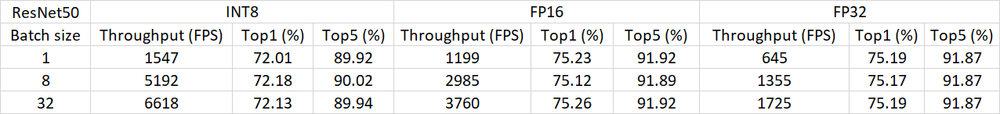

# OnnxRT with TRT EP
ONNX Runtime with TensorRT Execution Provider

### Running step by step
1. git clone https://github.com/microsoft/onnxruntime
2. In [dockerfiles/Dockerfile.tensorrt](https://github.com/microsoft/onnxruntime/blob/master/dockerfiles/Dockerfile.tensorrt#L8), changing the `TRT_CONTAINER_VERSION` into the latest version. I use `TRT_CONTAINER_VERSION=22.03`.
3. Build the docker image
   * `git submodule update --init`
   + `docker build -t onnxruntime-trt -f Dockerfile.tensorrt .`
   - `docker run -it onnxruntime-trt`

4. Download ILSVRC2012 validation dataset from kaggle or other sources.
5. Extract validation dataset JPEG files to 'ILSVRC2012/val'.
6. changing the following parts to control the inference precision. 
   * `calibration_table_generation_enable = True  # Enable/Disable INT8 calibration`
   * `os.environ["ORT_TENSORRT_FP16_ENABLE"] = "1"  # Enable FP16 precision`
   * `os.environ["ORT_TENSORRT_INT8_ENABLE"] = "1"  # Enable INT8 precision`
7. If you use int8, you can select the calibrator by changing the following line in 
   /onnxruntime/onnxruntime/python/tool/quantization/calibrat.py
   
   `calibrate_method=CalibrationMethod.MinMax,`
   
8. Run `python e2e_tensorrt_resnet_example.py `
### Some inference results
Using `calibrate_method=CalibrationMethod.MinMax` and `symmetric = False`
